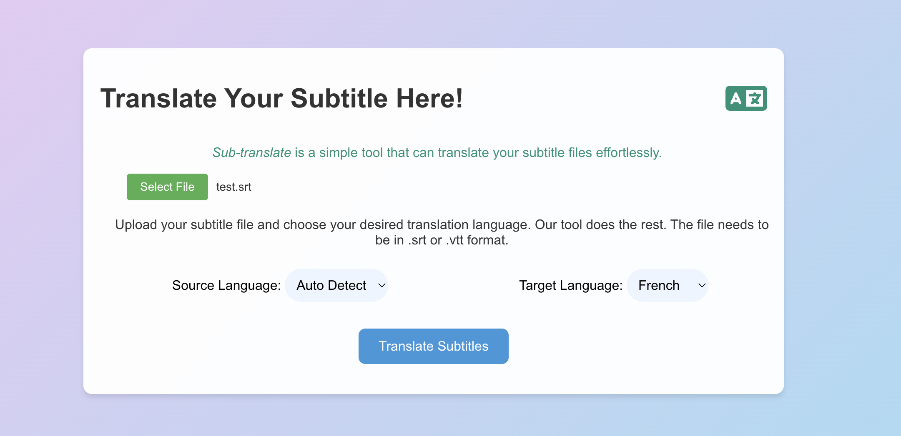
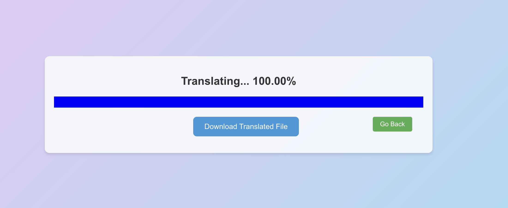

# Subtitle Translator
Subtitle Translator is a web application that allows users to upload `.srt` subtitle files and translate them into a different language.
The tool ensures that the translated subtitles retain their original formatting and structure.
The application is built using React.js, JavaScript to parse the subtitles and send the requests.
It also runs a Flask application in the backend which calls the [googletrans library](https://pypi.org/project/googletrans/), and googletrans uses the Google Ajax API to make calls to translate.

Initial Screen:


Waiting Screen (success):


## Files:

- **`src/`**: Contains the React application code.
   - **`components/`**: Reusable components such as `TranslateButton`.
   - **`pages/`**: Contains the `MainPage` and `WaitingPage` components for the main interface.
   - **`App.js`**: The main entry point for the React app.
   - **`index.js`**: Renders the React application to the DOM.

- **`backend/`**
  - **`server.py`**: The Flask backend server, which handles translation requests.
- **`package.json`**: Manages Node.js dependencies and scripts for the frontend.
- **`requirements.txt`**: Lists the Python dependencies required for the Flask backend.
- **`README.md`**: Documentation for the project.
- **`.gitignore`**: Specifies files and directories that should be ignored by Git, such as `node_modules/` and `.venv/`.


## Features
- **Upload and Translate**: Easily upload `.srt` files for translation.
- **Language Selection**: Choose source and target languages for translation. * From and To languages need to be different.
- **Preserve Formatting**: Retains the original structure and formatting of subtitles.
- **Progress Tracking**: Monitor the translation progress with a progress bar.
- **Download Translated File**: Download the translated subtitle file in `.srt` format.

## Installation

### Prerequisites

- [Node.js](https://nodejs.org/)
- [Python](https://www.python.org/)
- Flask (`pip install Flask`)
- Flask-CORS (`pip install flask-cors`)
- googletrans (`pip install googletrans==4.0.0-rc1`)

### Setup

1. **Clone the repository**:
    ```bash
    git clone https://github.com/your-username/subtitle-translator.git
    cd subtitle-translator
    ```

2. **Install the required Node.js dependencies**:
    ```bash
    npm install
    ```
   
3. **Create a local environment folder**:
    ```bash
    python3 -m venv .venv
    ```

4. **Activate the virtual environment**:

   - On macOS/Linux:
     ```bash
     source .venv/bin/activate
     ```
   - On Windows:
     ```bash
     .venv\Scripts\activate
     ```

5. **Install Python dependencies (required for backend)**:
    ```bash
    pip install -r requirements.txt
    ```

6. **Start the Flask server**:
    ```bash
    python backend/server.py
    ```

7. **Start the React application (in a different terminal)**:
    ```bash
    npm start
    ```

8. **Open your browser and go to `http://localhost:3000`.**

## Usage

1. Upload a `.srt` file by clicking the "Select File" button.
2. Choose the source language (auto-detect by default) and target language for translation.
3. Click "Translate Subtitles" to start the translation process.
4. Track the translation progress on the waiting page.
5. Once translation is complete, download the translated subtitle file.

## Contributing

To contribute, lease fork this repository, create a new branch, and submit a pull request with your changes.

## License

This project is licensed under the MIT License.